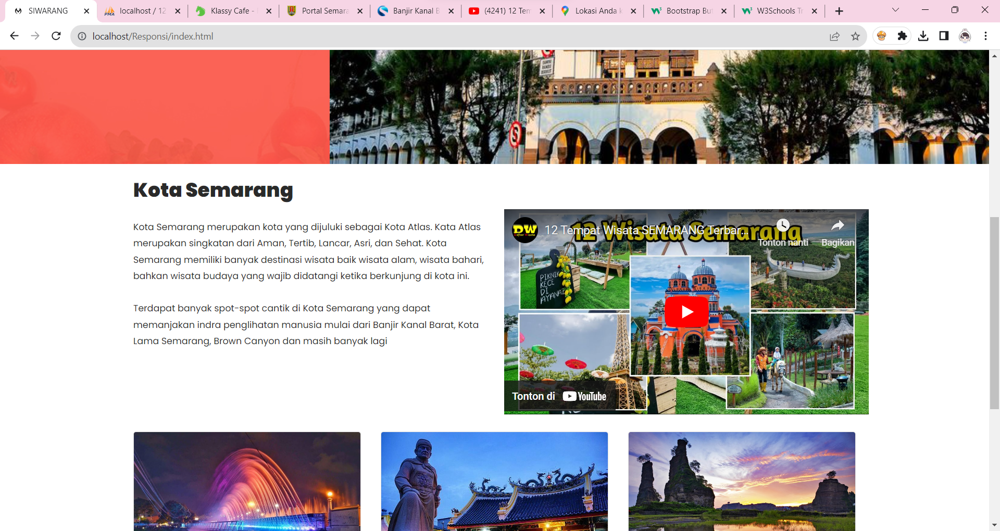
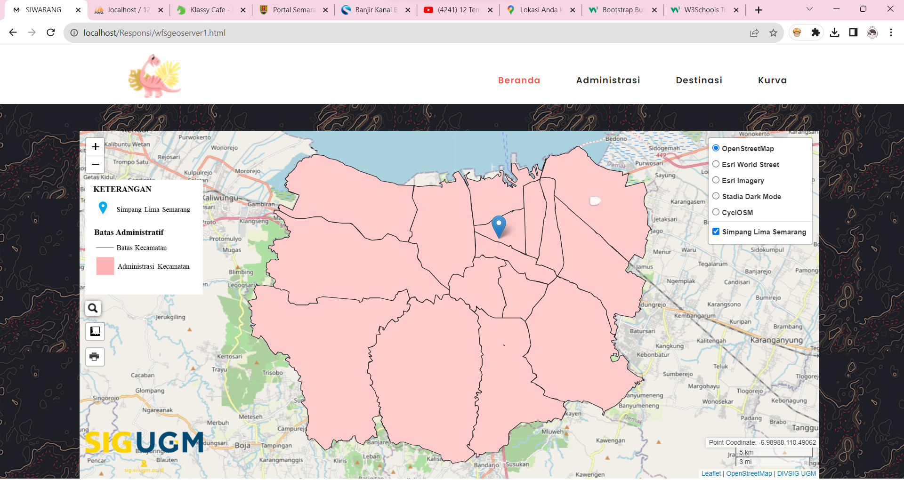
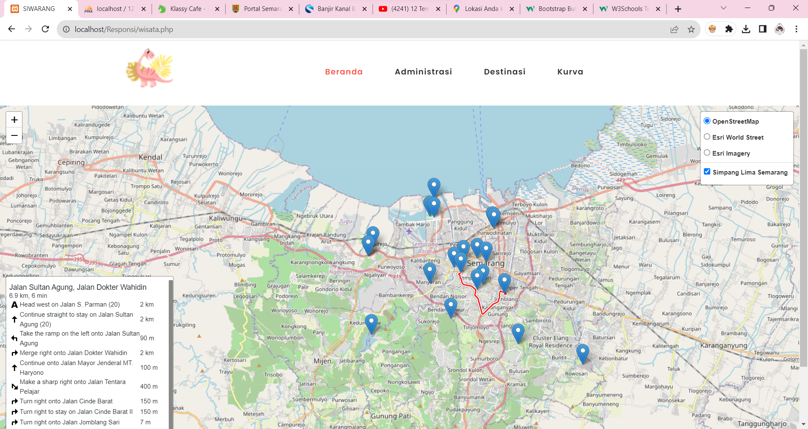
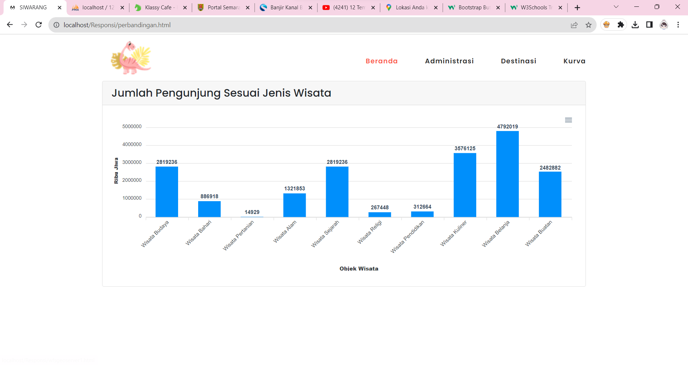

# Responsi PGWEB

# Nama Produk : SIWARANG (Destinasi Wisata Kota Semarang)

## Deskripsi Produk

SIWARANG (Destinasi Wisata Kota Semarang) merupakan sebuah situs website yang akan menampilkan lokasi wisata yang ada di Kota Semarang. Website ini berisikan daftar titik wisata, administrasi Kota Semarang dan juga chart yang menunjukkan kunjungan wisatawan pada objek wisata di Kota Semarang. Situs web ini akan berguna untuk wisatawan dalam mencari tujuan destinasi wisata di Kota Semarang.

## Komponen Pembangun Produk

- **HTML:** Digunakan untuk struktur dasar halaman web.
- **PHP** Digunakan untuk struktur dasar halaman web.
- **CSS:** Memperbaiki UI dan juga interaksi.
- **Bootstrap:** Framework CSS yang digunakan untuk pengembangan website yang responsif.
- **Leaflet.js:** Library JavaScript untuk pengembangan peta interaktif.
- **Geoserver:** Digunakan sebagai server GIS untuk menyediakan dan mengelola data geospasial.
- **PHPMyAdmin:** Digunakan untuk menyimpan database lokasi tempat wisata.

## Sumber Data

- Data lokasi wisata diambil dari [https://data.semarangkota.go.id/](https://data.semarangkota.go.id/) dan Google Maps.
- Data geospasial diakses melalui [InaGeoportal](https://www.inageoportal.id/), menyediakan informasi geospasial Indonesia.

## Tangkapan Layar Komponen Penting Produk

1. **Interface Utama:**
   

2. **Administrasi:**
   

3. **Titik Lokasi:**
   

4. **Chart:**
   

## Demo Produk

